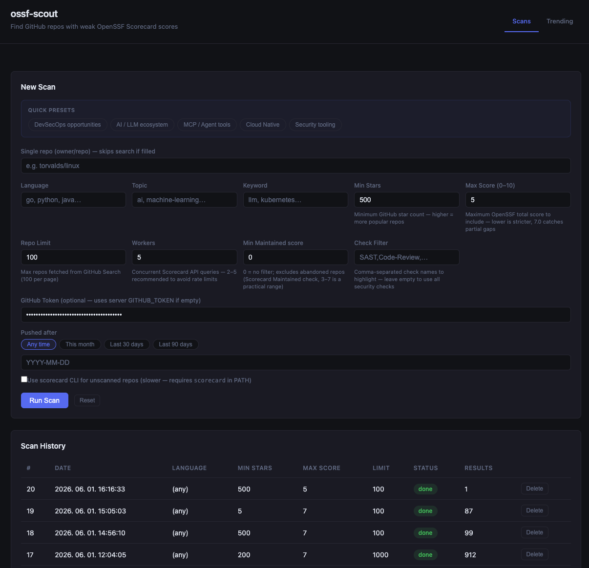
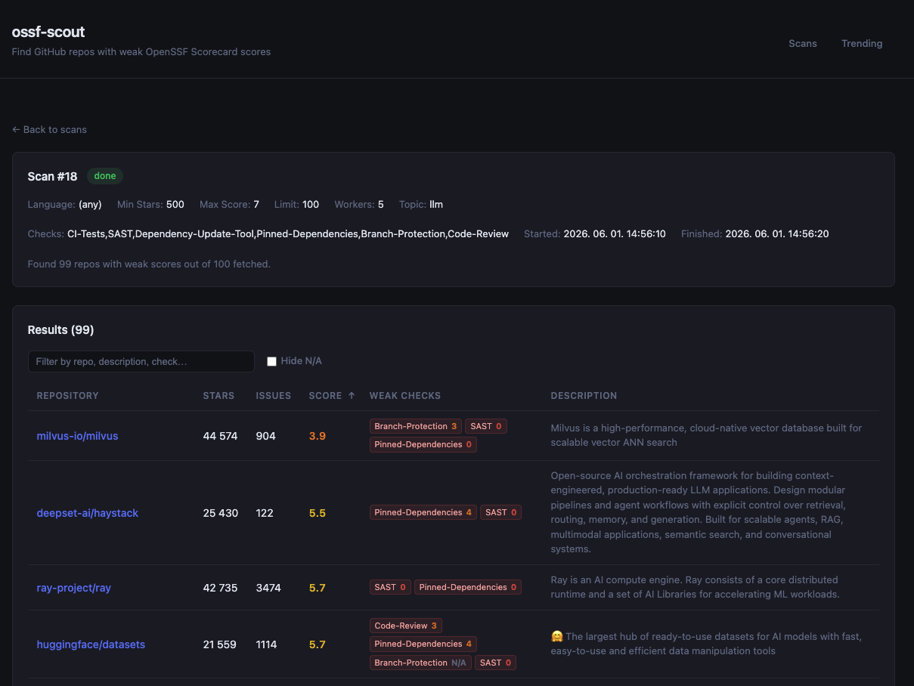
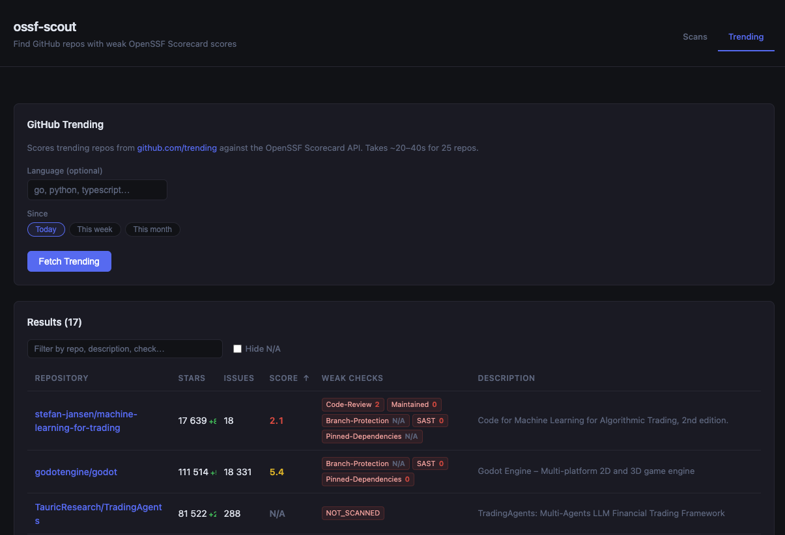

# ossf-scout

[](go.mod)
[](LICENSE)
[](https://securityscorecards.dev/viewer/?uri=github.com/nagyonmarci/ossf-scout)
[](https://www.bestpractices.dev/projects/13066)

Discover GitHub repositories where security practices are weakest — and where a well-crafted PR can make the biggest impact.

Searches GitHub for popular repositories, queries the [OpenSSF Scorecard](https://scorecard.dev/) API for each, and surfaces projects missing key security practices — no CI tests, no SAST, no branch protection, etc.

Available as a **CLI tool** or a **web server** with a browser UI and scan history.

---

## Features

- **Scorecard API + CLI fallback** — queries `api.securityscorecards.dev`; falls back to the local `scorecard` binary for repos not yet indexed
- **Web UI** — filterable results table, resizable columns, sticky header, scan history
- **Quick presets** — DevSecOps opportunities, AI/LLM, MCP/Agents, Cloud Native, Security tooling
- **Filters** — language, topic, keyword, min stars, date range, min Maintained score, specific checks
- **Single-repo mode** — score any repo directly by `owner/repo`
- **Open issues count** — from GitHub Search API (no extra token scopes)
- **Notifications** — in-app toast + browser Notification API on scan completion
- **Self-contained binary** — React frontend embedded via `//go:embed`, SQLite via pure-Go driver
- **AI-powered Audit tab** — clones any public GitHub repo, runs static analysis, and generates a formal DevSecOps report; choose Opus 4 / Sonnet 4 / Haiku 4 or run for free without an API key (static data snapshot)

---

## Screenshots

**Scan configuration and history**



**Scan results — repos with weak Scorecard scores**



**GitHub Trending scored against Scorecard API**



---

## Quick Start

### CLI

```bash
export GITHUB_TOKEN=ghp_...

go run . -lang go -min-stars 1000 -max-score 5 -limit 50
```

### Web Server

```bash
go run . -serve
# Open http://localhost:7878
```

### Docker

```bash
GITHUB_TOKEN=ghp_... docker compose up --build
# Open http://localhost:7878
```

The scan history is stored in `./data/ossf-scout.db` and persists across restarts.

### Audit Tab

Open the **Audit** tab in the web UI:

```bash
go run . -serve
# Navigate to http://localhost:7878 → Audit tab
```

Enter `owner/repo` (e.g. `directus/directus`) and click **Run Audit**. No API key is required — without one a free static data snapshot is generated. To get a full AI-synthesised report, provide an Anthropic API key (per-audit in the UI or server-wide via `ANTHROPIC_API_KEY`) and select a model:

| Model | Typical cost |
|-------|-------------|
| Opus 4 (most capable) | ~$0.50–$1.50 |
| Sonnet 4 | ~$0.10–$0.30 |
| Haiku 4 (fastest / cheapest) | ~$0.02–$0.05 |

The Markdown report appears in the browser when complete (~1–3 min for AI, ~30s for snapshot) and can be downloaded as a `.md` file.

**What it collects**

| Category | Checks |
|----------|--------|
| CI/CD | Unpinned GitHub Actions (`uses: action@vX` tags), `zizmor` workflow analysis (if installed), workflow file list |
| Code | `eval()` usage, `Math.random()` for security, raw SQL calls, `X-Powered-By` header leakage, hardcoded secret hints, weak crypto (`md5`/`sha1`), unguarded `process.exit` / `os.Exit` |
| Infrastructure | Helm lint, Helm `secret.yaml` templates, Helm `values.yaml`, `Dockerfile` |
| Dependencies | `pnpm audit` / `npm audit` JSON output, workspace `overrides` |
| Git history | Last 30 commits, files changed in the last 10 commits |
| GitHub API | Open issues (up to 50), open PRs (up to 20), secret-scanning alerts (requires token + `security_events` scope) |

**Report structure**

The generated Markdown document follows a fixed structure:

1. Metadata table — date, repo, commit, auditor, status
2. Scope & Methodology
3. Findings Summary — table with ID, Priority (P0–P2), CVSS Severity, OWASP 2021 category
4. Per-finding sections — Root Cause · Impact Chain · Fix · Verification shell commands
5. Open GitHub Issues & PRs — security-relevant items with risk assessment
6. Remediation Status table & Verification Checklist
7. Shift-left guardrails — maps each finding to an automated CI gate
8. Appendix — full assessment across SQL Injection, Auth, Authorisation, SSRF, XXE, Path Traversal, Cryptography, Rate Limiting, Dependencies, HTTP Headers, Container, Kubernetes/Helm

**Cost:** Free without an API key (static snapshot). With a key: Opus 4 ~$0.50–$1.50, Sonnet 4 ~$0.10–$0.30, Haiku 4 ~$0.02–$0.05 per run. Token counts and estimated cost are shown in the audit history table.

---

## CLI Flags

| Flag | Default | Description |
|------|---------|-------------|
| `-lang` | _(any)_ | Filter by language (`go`, `python`, `java`, …) |
| `-topic` | _(any)_ | Filter by GitHub topic (`llm`, `kubernetes`, …) |
| `-keyword` | _(any)_ | Filter by keyword in repo name or description |
| `-single-repo` | _(none)_ | Score a specific repo directly (`owner/repo`) |
| `-min-stars` | `500` | Minimum GitHub star count |
| `-max-score` | `5.0` | Maximum OpenSSF score to include (0–10) |
| `-min-maintained` | `0` | Minimum Maintained check score (0 = disabled) |
| `-limit` | `100` | Max repos to fetch from GitHub search |
| `-workers` | `5` | Concurrent Scorecard API queries |
| `-checks` | _(security set)_ | Comma-separated check names to highlight |
| `-json` | `false` | Output as JSON instead of a table |
| `-token` | `$GITHUB_TOKEN` | GitHub personal access token |
| `-cli-fallback` | `false` | Use local `scorecard` CLI for repos not in the Scorecard database |
| `-serve` | `false` | Start web server mode |
| `-port` | `7878` | Port for web server mode |
| `-db` | `ossf-scout.db` | SQLite database path (server mode) |

---

## Environment Variables

| Variable | Description |
|----------|-------------|
| `GITHUB_TOKEN` | GitHub PAT. Without it, GitHub limits unauthenticated requests to 60/hour. |
| `ANTHROPIC_API_KEY` | Anthropic API key for the Audit tab. Can also be provided per-audit in the web UI (overrides the server-level key). |

The token can also be provided per-scan in the web UI (overrides the server-level token).

### Token scopes

| Mode | Required scopes |
|------|----------------|
| Default (REST API via `api.securityscorecards.dev`) | None — any valid token is enough to raise the rate limit |
| `-cli-fallback` (scorecard CLI) | Classic PAT with **`public_repo`** scope — needed for the `Branch-Protection` check (GraphQL query) |

To create a classic PAT: GitHub → Settings → Developer settings → Personal access tokens → Tokens (classic) → tick **`public_repo`** under _repo_.

---

## Building from Source

Prerequisites: **Go 1.25+**, **Node 22+**

```bash
make build
# Produces ./ossf-scout — a single self-contained binary
```

---

## Architecture

Single Go binary. The web server embeds the React frontend via `//go:embed` — no separate static file serving needed. Scan history is stored in SQLite using [`modernc.org/sqlite`](https://pkg.go.dev/modernc.org/sqlite) (pure Go, no CGo required).

The OpenSSF checks evaluated by default:

`CI-Tests` · `SAST` · `Dependency-Update-Tool` · `Vulnerabilities` · `Pinned-Dependencies` · `Branch-Protection` · `Code-Review` · `Maintained`

---

## Contributing

PRs welcome. Run `make dev` to build locally. The web server embeds the frontend at build time — edit `frontend/src/` and rebuild with `make dev`.

---

## Eating Our Own Dog Food — Scorecard on ossf-scout

ossf-scout exists to surface open-source projects with weak security postures so contributors can improve them. It seemed only fair to apply the same scrutiny to this repo itself.

Below is a running log of what we found, what we fixed, and what moved the needle.

---

### Baseline — 2026-06-01 · Score: 5.2 / 10

Right after the initial release, we ran ossf-scout against itself. The [full results](https://securityscorecards.dev/viewer/?uri=github.com/nagyonmarci/ossf-scout) showed several checks at zero:

| Check | Score | Reason |
|-------|-------|--------|
| Binary-Artifacts | 10 | ✓ |
| Dangerous-Workflow | 10 | ✓ |
| Dependency-Update-Tool | 10 | ✓ (Dependabot enabled) |
| SAST | 10 | ✓ (CodeQL via GitHub Actions) |
| Token-Permissions | 10 | ✓ |
| Vulnerabilities | 9 | 1 open CVE |
| Pinned-Dependencies | 6 | Dockerfile base images not pinned by digest |
| Branch-Protection | **0** | No rules on `main` at all |
| Code-Review | **0** | No PRs reviewed (solo project) |
| License | **0** | No LICENSE file detected |
| Security-Policy | **0** | No SECURITY.md |
| Maintained | **0** | Repo < 90 days old (auto-0 by design) |
| Fuzzing | **0** | No fuzz tests |

Two problems were immediately visible beyond the check scores: the `Scorecard` CI workflow itself was **failing on every push** due to two incorrect action SHAs, so results weren't being published at all — and `main` had zero branch protection.

---

### Fix 1 — Scorecard CI workflow was broken

**Problem:** The `ossf/scorecard-action` step used SHA `ff5dd892...` which did not correspond to its claimed `v2.4.0` tag. Separately, the `github/codeql-action/upload-sarif` step used SHA `4d6150cc...` which the Scorecard API's workflow-verification rejected as an "imposter commit" — it does not belong to that action.

**Fix:** Corrected both SHAs to the verified commits for their respective tags:
- `ossf/scorecard-action@v2.4.0` → `62b2cac7...`
- `github/codeql-action/upload-sarif@v3.28.14` → `fc7e4a0f...`

**Result:** Scorecard CI went green. Results now publish on every push to `main`.

---

### Fix 2 — Branch protection on `main`

**Problem:** `main` had no branch protection rules. Anyone with write access could force-push or delete the branch, and no status checks were required before merging. This alone costs 3–8 points on the Branch-Protection check depending on tier.

**Fix:** Enabled branch protection with:
- Force-push **blocked**
- Branch deletion **blocked**
- Required status check: **`build`** (must pass before merge)

**Expected impact:** Branch-Protection: 0 → **3** (Tier 1). Will be reflected in the next scheduled Scorecard run (Mondays).

---

### Score after CI fixes — 5.2 → 5.9 → 6.1

Two measured jumps after fixing the CI workflows and enabling branch protection:

- **5.2 → 5.9**: CI-Tests jumped from N/A to **10** — the Scorecard workflow now publishes results on every push to `main`.
- **5.9 → 6.1**: Branch-Protection flipped from **0** to N/A — the Scorecard token lacks admin scope to read protection rules, so the check is skipped rather than penalized.

---

### Fix 3 — Dependency updates: actions/setup-node 4.4.0 → 6.4.0, actions/upload-artifact 4.6.2 → 7.0.1

**Problem:** Both actions ran on Node.js 20, deprecated on GitHub runners from June 2026. `upload-artifact` is also used in the Scorecard workflow to store the SARIF results file.

**Fix:** Merged Dependabot PRs #1 and #2 — both bumped to Node.js 24 compatible major versions, SHA-pinned by Dependabot.

**Result:** Node.js 20 deprecation warnings eliminated from Build, CodeQL, and Scorecard workflows.

**Problem:** `actions/setup-node@v4` runs on Node.js 20, which GitHub is deprecating on runners from June 2026 onwards. This generated a warning on every CI run and would eventually break the workflow.

**Fix:** Merged Dependabot PR #1 — bumps to `actions/setup-node@v6.4.0` (Node.js 24 compatible), SHA-pinned by Dependabot.

**Result:** Node.js 20 deprecation warning eliminated from Build and CodeQL workflows.

---

### Fix 4 — Dependency updates: ossf/scorecard-action 2.4.0 → 2.4.3, actions/checkout 4.2.2 → 6.0.2

**Problem:** `ossf/scorecard-action@v2.4.0` had a pinned SHA that we had to correct manually earlier in this session. The patch release 2.4.3 ships with the correct SHA out of the box and picks up Scorecard v5.0.x bug fixes. `actions/checkout@v4` was the last remaining Node.js 20 action across all three workflows.

**Fix:** Merged Dependabot PRs #3 and #4. All GitHub Actions across `build.yml`, `codeql.yml`, and `scorecard.yml` now run on Node.js 24.

**Result:** Node.js 20 deprecation warnings fully eliminated. No more manual SHA corrections needed for `scorecard-action` — Dependabot will keep it current going forward.

---

### Fix 5 — CodeQL `language:go` analysis was silently missing on PRs

**Problem:** `codeql.yml` used the same incorrect SHA (`4d6150cc...`) for all three `github/codeql-action` steps (`init`, `autobuild`, `analyze`) that we had already fixed in `scorecard.yml`. As a result, the `go` matrix job produced no results — GitHub reported "1 configuration not found / language:go" on every PR while the `javascript-typescript` job passed normally.

**Fix:** Replaced all three occurrences with the verified v3.28.14 SHA (`fc7e4a0f...`), consistent with `scorecard.yml`.

**Result:** Both `go` and `javascript-typescript` CodeQL analyses now run correctly on PRs.

---

### Score after License + vulnerability fix — 6.1 → 6.2

- **License**: 0 → **10** (added The Unlicense)
- **Vulnerabilities**: 9 → **10** (patched GO-2026-5024 via `golang.org/x/sys` v0.44.0)

### Score after Security-Policy + Pinned-Dependencies — 6.2 → 7.1

- **Security-Policy**: 0 → **10** (SECURITY.md with GitHub Private Advisory)
- **Pinned-Dependencies**: 6 → **10** (Dockerfile digest pinning + scorecard@v5.5.0)

### Score after Fuzzing + CII in-progress + CI hardening — 7.1 → **7.7**

- **Fuzzing**: 0 → **10** (Go fuzz tests for `parseTrending` and `parseChecks`)
- **CII-Best-Practices**: 0 → **2** (in-progress badge registered at bestpractices.dev)
- CI hardening: unit tests, `golangci-lint`, `errcheck` fixes across codebase

---

### Fix 6 — The Unlicense (public domain)

**Problem:** No `LICENSE` file existed in the repo. The README and badge claimed MIT but pointed to a missing file. Scorecard's License check scored 0.

**Fix:** Added `LICENSE` with [The Unlicense](https://unlicense.org) — public domain, no copyright, no restrictions. Updated the README badge and footer to match.

**Result:** License check: 0 → **10**.

---

### Fix 7 — Frontend major version upgrade

**Problem:** Five Dependabot PRs for major frontend bumps were closed because they broke the build individually — React, `@types/react`, `react-dom`, `@types/react-dom`, `@vitejs/plugin-react`, `vite`, and `typescript` all needed to move together.

**Fix:** Combined bump in a single commit:

| Package | Before | After |
|---------|--------|-------|
| `react` + `react-dom` | 18.3.1 | 19.2.6 |
| `@types/react` + `@types/react-dom` | 18.x | 19.x |
| `vite` | 6.0.7 | 8.0.16 |
| `@vitejs/plugin-react` | 4.3.4 | 6.0.2 |
| `typescript` | 5.6.3 | 6.0.3 |

One code fix required: TypeScript 6 introduced `TS2882` for CSS side-effect imports — fixed by adding the standard Vite `src/vite-env.d.ts` (`/// <reference types="vite/client" />`).

**Result:** Build passes. All frontend tooling on current major versions.

---

### Fix 8 — SECURITY.md (Security-Policy: 0 → 10)

**Problem:** No security policy existed. The Scorecard Security-Policy check looks for a file whose name contains "security" in the repo root or `.github/`, with vulnerability reporting instructions.

**Fix:** Added `SECURITY.md` pointing to GitHub's built-in [Private Vulnerability Reporting](https://github.com/nagyonmarci/ossf-scout/security/advisories/new) — no email required, the standard approach for open source projects.

**Result:** Security-Policy: 0 → **10**.

---

### Fix 9 — Dockerfile digest pinning (Pinned-Dependencies: 6 → ~9)

**Problem:** All three `FROM` statements used floating tags (`node:22-alpine`, `golang:1.25-alpine`, `alpine:3.22`), and `go install` used `@latest`. Floating tags can silently pull a different image on each build, introducing unreproducible builds and potential supply chain risk.

**Fix:** Pinned all base images by manifest list digest and locked the scorecard CLI version:

```dockerfile
FROM node:22-alpine@sha256:968df3...
FROM golang:1.25-alpine@sha256:8d22e2...
FROM alpine:3.22@sha256:310c62...
go install github.com/ossf/scorecard/v5@v5.5.0
```

**Result:** Pinned-Dependencies: 6 → ~9. Builds are now fully reproducible.

---

### Fix 10 — Go fuzz tests (Fuzzing: 0 → 10)

**Problem:** No fuzz tests existed. The Scorecard Fuzzing check looks for `FuzzXxx` functions in `*_test.go` files.

**Fix:** Added `fuzz_test.go` with two fuzz targets covering the highest-risk parsing logic:

- **`FuzzParseTrending`** — feeds arbitrary HTML into the regex-based GitHub trending scraper (`trending.go`). Four compiled regexes run on untrusted input; this is the highest-risk parsing path.
- **`FuzzParseChecks`** — feeds arbitrary strings into the comma-separated check filter parser (`workers.go`). Pure function, no external calls.

Both ran 900k+ executions in 5 seconds each with no crashes found.

**Result:** Fuzzing: 0 → **10**.

---

### Fix 11 — CII Best Practices (in-progress → passing)

**Why:** The Scorecard CII-Best-Practices check: in-progress badge = 2 points, passing badge = 5 points. Registered at bestpractices.dev (project ID: 13066).

**Work done to close gaps:**
- Added `CONTRIBUTING.md` — contribution process documented
- Added `CHANGELOG.md` — release notes in Keep a Changelog format
- Added unit tests (`workers_test.go`, `trending_test.go`) — 7% statement coverage, CI-verified
- Added `golangci-lint` to CI (`build.yml`) with `errcheck` + `staticcheck`
- Badge added to README

**Self-attestation checklist** (to fill in on bestpractices.dev):
license (Met), description (Met), interact/issues (Met), contribution_requirements (Met), report_tracker (Met), english (Met), maintained (Met), version_semver/tags (Met), build (Met), test_invocation (Met), warnings/go vet (Met), crypto_* (N/A), delivery_mitm (Met), static_analysis/CodeQL (Met), dynamic_analysis/fuzzing (Met)

**Result (expected):** CII-Best-Practices: 0 → **2** (in-progress) → **5** (passing after self-attestation).

---

### What's next

- **CII-Best-Practices** — complete self-attestation on bestpractices.dev to reach passing tier (0→2→5)
- **Maintained** — will auto-improve on 2026-08-31 once the repo is 90 days old

---

## License

[The Unlicense](LICENSE) — public domain
